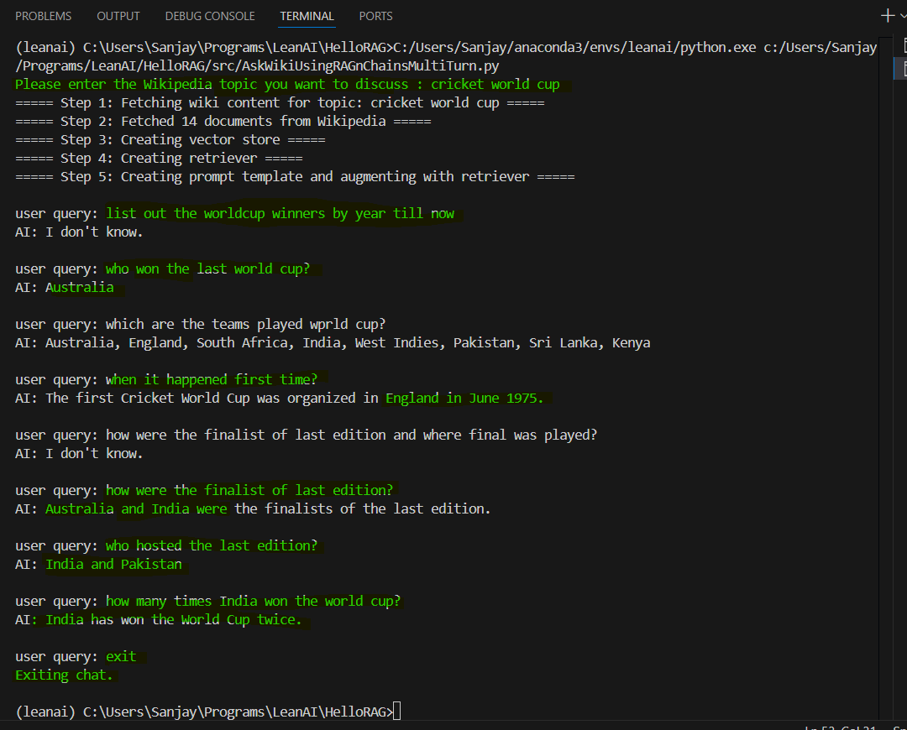

# HelloRAG: Wikipedia Q&A with RAG and LangChain

This project demonstrates how to build a simple Retrieval-Augmented Generation (RAG) pipeline using LangChain, OpenAI, and Wikipedia as a knowledge source. The system fetches content from Wikipedia, splits it into chunks, embeds it, stores it in a vector database (FAISS), and answers user queries using a language model.

## Features
- Fetches and processes Wikipedia articles on any topic
- Splits content into manageable chunks for efficient retrieval
- Embeds and stores content using FAISS vector store
- Answers questions using OpenAI's language model with context from Wikipedia

## How it Works


The following steps describe the end-to-end workflow of this project:

1. 🚀 **Start with a Question or Topic**
   - The user provides a topic (e.g., "Web scraping") or asks a question.

2. 📚 **Fetch Wikipedia Content**
   - The system uses LangChain's `WikipediaLoader` to retrieve the full article for the topic.

3. ✂️ **Split the Article into Chunks**
   - The article is divided into smaller, overlapping text chunks using `RecursiveCharacterTextSplitter` for better retrieval.

4. 🧠 **Generate Embeddings**
   - Each chunk is converted into a vector (embedding) using OpenAI's embedding model, capturing its semantic meaning.

5. 🗂️ **Store in Vector Database (FAISS)**
   - All embeddings are stored in a FAISS vector database, enabling fast similarity search.

6. ❓ **User Query Processing**
   - When a user asks a question, it is also embedded and compared to the stored vectors to find the most relevant chunks.

7. 📝 **Build a Prompt with Context**
   - The most relevant chunks are combined with the user's question to form a prompt for the language model.

8. 🤖 **Generate an Answer**
   - The prompt is sent to OpenAI's language model, which generates a context-aware answer.

This approach ensures that answers are grounded in real Wikipedia content, making them more accurate and reliable.

## Setup

1. Clone the repository.
2. Install dependencies:
   ```sh
   pip install -r requirements.txt
   ```
3. Set your OpenAI API key in a `.env` file:
   ```env
   OPENAI_API_KEY=your-api-key-here
   ```
4. Run the main script:
   ```sh
   python src/getWikiContent.py
   ```

## Example Usage

## Working Example

Below is a real example of the RAG pipeline in action, as shown in the screenshot:



Example 2:
``` 
Topic: Web scraping
Query: What is web scraping?

Answer:
Web scraping is a technique used to extract data from websites. It typically involves fetching web pages and parsing their content to retrieve specific information. Web scraping can be performed using various programming languages and tools, and is commonly used for data collection, analysis, and automation tasks.
```

## Explanatory Diagram

```
+-----------+      +-------------------+      +-------------------+      +-------------------+
|  User     | ---> | Wikipedia Loader  | ---> | Text Splitter     | ---> | Embedding Model   |
|  Query    |      | (LangChain)       |      | (LangChain)       |      | (OpenAI)          |
+-----------+      +-------------------+      +-------------------+      +-------------------+
                                                                                 |
                                                                                 v
+-------------------+      +-------------------+      +-------------------+      +-------------------+
| Vector Store      | <--- | Similarity Search | <--- | Prompt Template   | <--- | Language Model    |
| (FAISS)           |      | (LangChain)       |      | (LangChain)       |      | (OpenAI)          |
+-------------------+      +-------------------+      +-------------------+      +-------------------+
```


## License
This project is for educational and research purposes.
